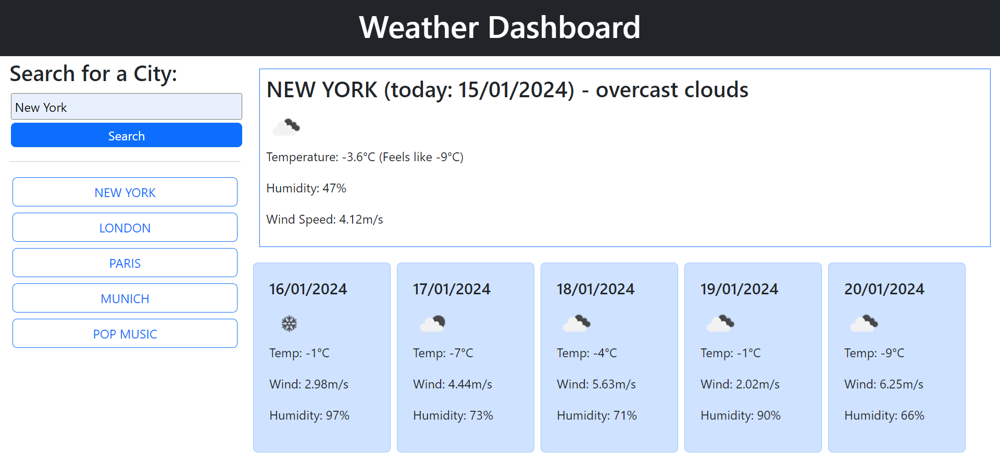

# Weather Dashboard

#### Project status
Development for this project is on pause, for now.

## Description
A challenge for myself to build a basic weather dashboard application using web-APIs. The application takes data from OpenWeather's free API forecast and weather and translates it into a dashboard with a simple userface, extracting only certain details such as temperature, humidity and weather icons. Users can search for a city and find the appropriate data displayed. The project makes use of fetch functions and query-URL in order to retrieve the data, as well as CSS and bootstrap styling and some features of javasript to make it interactive/dynamic.

https://rowankinross.github.io/rkinross_weather_dashboard/

## Visuals
The following image and gif show the appearance, usage and user interface of the application:

### screen-capture:

### gif demo:

## Installation
n/a

## Usage
The title and the header bar show the name of the application. The side bar asks for user input to search for a city. Upon submitting a city name, the program runs, displaying the current weather in that location, as well as the projected forecast of the next 5 days. Previous searches are stored as buttons, allowing the user to click on an old search, rather than typing in a new one. Previous searches are stored locally and therefore continue to be displayed on the page even after a refresh, unless the local storage is cleared. Search history is displayed newest to oldest, and if the same city is searched for again, the corresponding button is shifted upwards to the most recent. The 'current weather' container shows today's date, today's temperature (both the accurate and the 'feels-like' temperatures), a weather icon, humidity and windspeed. Each forecast card shows data from one day of the 5 days of forecast and includes a projected date, a weather icon, temperature (rounded), wind and humidity.

## Contributing
As this is a personal project, designed to challenge and test my skills, I am not currently looking for contributors. However, there may be a opening for this in the future.

## Credits

OpenWeather for their free-to-access API, used for all weather data on this project - https://openweathermap.org/api 

edX challenge materials for setting the challenge and providing me with the skills to take on this project.

## License

MIT License - refer to LICENSE in the repo.